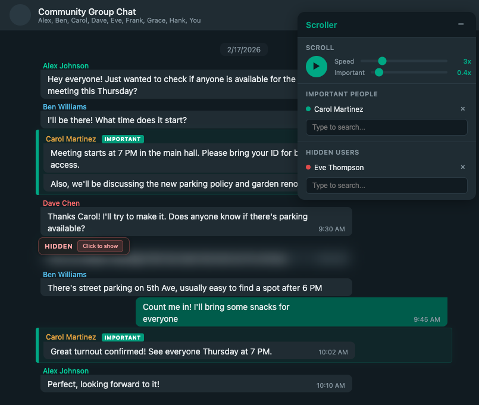
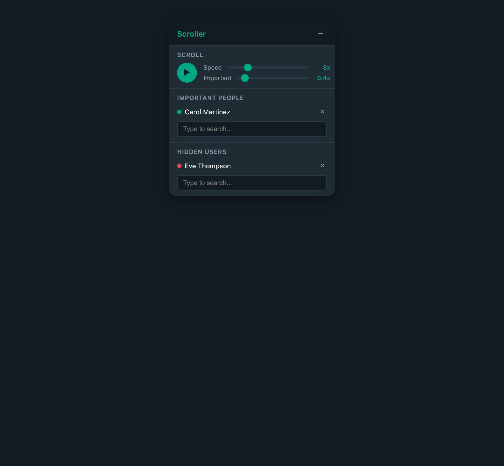

# WhatsApp Group Chat Scroller

A Chrome extension that auto-scrolls through WhatsApp Web group chats with smart features: speed control, important people highlighting, and hidden user blurring.



## Install

1. Download or clone this repo
2. Open `chrome://extensions` in Chrome
3. Enable **Developer mode** (top-right toggle)
4. Click **Load unpacked** and select this folder
5. Open [web.whatsapp.com](https://web.whatsapp.com) and enter a group chat

## Usage

Click the **Scroller** button in the top-right corner to open the control panel.



### Auto-Scroll

- Hit the **play button** to start auto-scrolling down through the chat
- **Speed slider** controls how fast it scrolls (1x-10x)
- **Important slider** controls the scroll speed when passing important people's messages (0.1x-5x) - the transition is smooth, not abrupt
- Scrolling auto-pauses when it reaches the end of the chat

### Important People

- Use the search box under **Important People** to find and add participants
- You can also type a partial name and press Enter to add it (useful for names not yet visible in the chat)
- Messages from important people get:
  - A green left border and subtle green background
  - An **IMPORTANT** badge next to their name
  - Automatic scroll slowdown (controlled by the Important speed slider)
- Highlights are visible even when not auto-scrolling (during manual scroll)

### Hidden Users

- Use the search box under **Hidden Users** to add people whose messages you want to blur out
- Hidden messages are blurred with a sticky **HIDDEN** badge and **Click to show** button
- Click the button to temporarily reveal a hidden message
- Partial name matching works here too

### Other Features

- **Draggable panel** - grab the header to move it anywhere
- **Minimize** - click the minus button to collapse to a small "Scroller" pill; click it again to expand
- **Persistent settings** - important people, hidden users, and speed settings are saved across page reloads
- **Global settings** - all settings apply across every chat
- **Mixed-script name support** - names with Hebrew, Arabic, or other scripts mixed with Latin characters are searchable (invisible Unicode direction marks are stripped)

## Permissions

- **storage** - saves your settings (important people, hidden users, scroll speeds) locally in Chrome
- Runs only on `web.whatsapp.com`

## Development

No build tools needed. Edit the files directly and reload the extension from `chrome://extensions`.

```
whatsapp-groupchats-extension/
  manifest.json     # Extension config (Manifest V3)
  content.js        # Core logic: scroll, detect, blur, highlights, panel
  content.css       # Panel styles, blur, highlight effects
  panel.html        # Control panel markup
  background.js     # Minimal service worker
  icons/            # Extension icons
```
